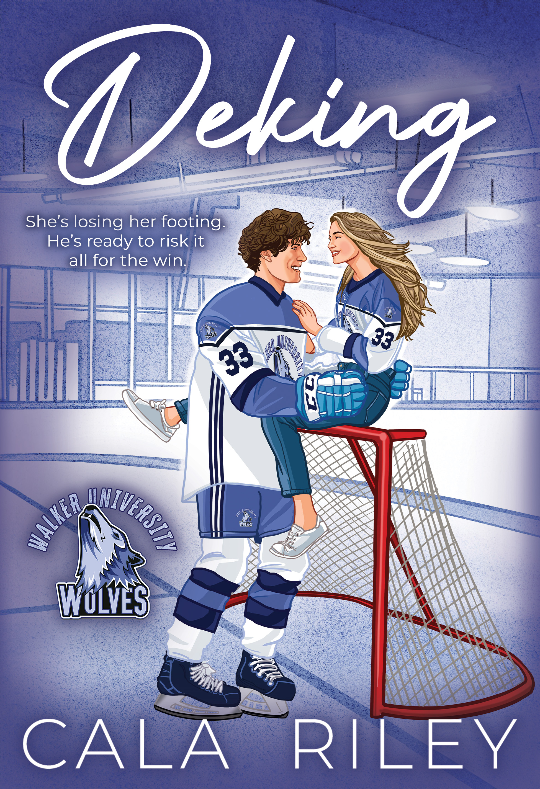

# Wolfpack Email Templates — Raw HTML

## Context
These are 4 New Release email templates for Wolfpack Publishing's imprints, competing against an existing design. See the repo README for the full comparison brief.

Each template below is complete, production-ready email HTML (table-based, MSO conditionals, responsive). The cover images are referenced as relative paths (`covers/filename.jpg`) — you can view them rendered at the GitHub Pages links above.

---

## 1. Wolfpack Publishing (Westerns)
**Live preview:** https://dukedawg.github.io/wolfpack-email-templates/wolfpack_nr.html

```html
<!DOCTYPE html PUBLIC "-//W3C//DTD XHTML 1.0 Transitional//EN" "http://www.w3.org/TR/xhtml1/DTD/xhtml1-transitional.dtd">
<html xmlns="http://www.w3.org/1999/xhtml" xmlns:v="urn:schemas-microsoft-com:vml" xmlns:o="urn:schemas-microsoft-com:office:office">
<head>
<meta http-equiv="Content-Type" content="text/html; charset=UTF-8" />
<meta name="viewport" content="width=device-width, initial-scale=1.0" />
<meta http-equiv="X-UA-Compatible" content="IE=edge" />
<meta name="color-scheme" content="light" />
<meta name="supported-color-schemes" content="light" />
<title>Wolfpack Publishing — New Releases</title>
<!--[if gte mso 9]>
<xml>
<o:OfficeDocumentSettings>
<o:AllowPNG/>
<o:PixelsPerInch>96</o:PixelsPerInch>
</o:OfficeDocumentSettings>
</xml>
<![endif]-->
<style type="text/css">
@import url('https://fonts.googleapis.com/css2?family=Merriweather:wght@400;700&family=Montserrat:wght@400;600;700;800&display=swap');
/* Reset */
body, table, td, a { -webkit-text-size-adjust: 100%; -ms-text-size-adjust: 100%; }
table, td { mso-table-lspace: 0pt; mso-table-rspace: 0pt; }
img { -ms-interpolation-mode: bicubic; border: 0; outline: none; text-decoration: none; }
body { margin: 0; padding: 0; width: 100% !important; height: 100% !important; background-color: #E8E0D6; }
/* Responsive */
@media only screen and (max-width: 640px) {
  .container { width: 100% !important; }
  .mobile-padding { padding-left: 20px !important; padding-right: 20px !important; }
  .book-cell { display: block !important; width: 100% !important; text-align: center !important; padding-bottom: 30px !important; }
  .book-cover { width: 200px !important; }
  .header-logo { width: 120px !important; }
  .header-title { font-size: 28px !important; letter-spacing: 6px !important; }
  .header-sub { font-size: 12px !important; letter-spacing: 4px !important; }
}
</style>
</head>
<body style="margin:0; padding:0; background-color:#E8E0D6;">
<!-- Preheader -->
<span style="display:none !important; visibility:hidden; mso-hide:all; font-size:1px; color:#E8E0D6; line-height:1px; max-height:0px; max-width:0px; opacity:0; overflow:hidden;">
Frontier justice, fast guns, and new titles from your favorite Wolfpack authors. Saddle up.
&zwnj;&nbsp;&zwnj;&nbsp;&zwnj;&nbsp;&zwnj;&nbsp;&zwnj;&nbsp;&zwnj;&nbsp;&zwnj;&nbsp;&zwnj;&nbsp;&zwnj;&nbsp;&zwnj;&nbsp;&zwnj;&nbsp;&zwnj;&nbsp;&zwnj;&nbsp;&zwnj;&nbsp;&zwnj;&nbsp;
</span>

<!-- Outlook wrapper -->
<!--[if mso]><table role="presentation" cellpadding="0" cellspacing="0" border="0" width="640" align="center"><tr><td><![endif]-->

<!-- Main Container -->
<table role="presentation" cellpadding="0" cellspacing="0" border="0" width="100%" style="max-width:640px; margin:0 auto;">

  <!-- ====== HEADER ====== -->
  <tr>
    <td style="background-color:#8B4513; padding:0;">
      <!-- Top decorative border -->
      <table role="presentation" cellpadding="0" cellspacing="0" border="0" width="100%">
        <tr>
          <td style="background-color:#6B3410; height:4px; font-size:1px; line-height:1px;">&nbsp;</td>
        </tr>
      </table>
      <!-- Header content -->
      <table role="presentation" cellpadding="0" cellspacing="0" border="0" width="100%">
        <tr>
          <td align="center" style="padding:30px 20px 10px 20px;">
            
          </td>
        </tr>
        <tr>
          <td align="center" style="padding:10px 20px 0 20px;">
            <table role="presentation" cellpadding="0" cellspacing="0" border="0">
              <tr>
                <td style="width:40px; border-bottom:1px solid #C4956A;">&nbsp;</td>
                <td style="padding:0 12px;">
                  <p style="margin:0; font-family:'Montserrat', Arial, sans-serif; font-size:32px; font-weight:800; color:#F5E6D3; letter-spacing:8px; text-align:center; line-height:1.2;" class="header-title">NEW RELEASES</p>
                </td>
                <td style="width:40px; border-bottom:1px solid #C4956A;">&nbsp;</td>
              </tr>
            </table>
          </td>
        </tr>
        <tr>
          <td align="center" style="padding:12px 20px 30px 20px;">
            <p style="margin:0; font-family:'Montserrat', Arial, sans-serif; font-size:11px; font-weight:600; color:#C4956A; letter-spacing:5px; text-transform:uppercase;" class="header-sub">Est. 2013 &bull; Western &bull; Adventure &bull; Frontier</p>
          </td>
        </tr>
      </table>
      <!-- Bottom decorative border -->
      <table role="presentation" cellpadding="0" cellspacing="0" border="0" width="100%">
        <tr>
          <td style="background-color:#6B3410; height:2px; font-size:1px; line-height:1px;">&nbsp;</td>
        </tr>
      </table>
    </td>
  </tr>

  <!-- ====== BODY ====== -->
  <tr>
    <td style="background-color:#FAF8F5;">

      <!-- Opener -->
      <table role="presentation" cellpadding="0" cellspacing="0" border="0" width="100%">
        <tr>
          <td style="padding:35px 40px 25px 40px;" class="mobile-padding">
            <p style="margin:0; font-family:'Merriweather', Georgia, serif; font-size:15px; line-height:1.7; color:#4A3728; text-align:center;">
              Saddle up &mdash; this week&rsquo;s new releases are loaded with frontier justice, fast guns, and the kind of trouble that follows a man across state lines. Two new titles from your favorite Wolfpack authors.
            </p>
          </td>
        </tr>
        <tr>
          <td align="center" style="padding:0 40px 30px 40px;">
            <table role="presentation" cellpadding="0" cellspacing="0" border="0">
              <tr>
                <td style="width:60px; border-bottom:2px solid #8B4513;">&nbsp;</td>
              </tr>
            </table>
          </td>
        </tr>
      </table>

      <!-- ====== BOOK 1 ====== -->
      <table role="presentation" cellpadding="0" cellspacing="0" border="0" width="100%">
        <tr>
          <td style="padding:10px 40px 0 40px;" class="mobile-padding">
            <table role="presentation" cellpadding="0" cellspacing="0" border="0" width="100%">
              <tr>
                <td align="center" style="padding-bottom:20px;">
                  <!--[if mso]>
                  <table role="presentation" cellpadding="0" cellspacing="0" border="0"><tr><td style="padding:4px; background-color:#E8E0D6;">
                  <![endif]-->
                  
                  <!--[if mso]>
                  </td></tr></table>
                  <![endif]-->
                </td>
              </tr>
              <tr>
                <td align="center" style="padding-bottom:6px;">
                  <p style="margin:0; font-family:'Montserrat', Arial, sans-serif; font-size:18px; font-weight:700; color:#4A3728; text-transform:uppercase; letter-spacing:1px; line-height:1.3;">Laramie Davis: The Complete Western Series</p>
                </td>
              </tr>
              <tr>
                <td align="center" style="padding-bottom:14px;">
                  <p style="margin:0; font-family:'Montserrat', Arial, sans-serif; font-size:13px; font-weight:600; color:#8B4513; letter-spacing:1px;">by Brent Towns</p>
                </td>
              </tr>
              <tr>
                <td align="center" style="padding-bottom:22px;">
                  <p style="margin:0; font-family:'Merriweather', Georgia, serif; font-size:14px; line-height:1.7; color:#5D4E42; max-width:480px;">
                    A drifter with a fast gun and a slow temper rides into trouble he can&rsquo;t ride away from. The complete series in one volume &mdash; every showdown, every betrayal, every mile of dusty trail.
                  </p>
                </td>
              </tr>
              <tr>
                <td align="center" style="padding-bottom:35px;">
                  <!-- Bulletproof button -->
                  <table role="presentation" cellpadding="0" cellspacing="0" border="0">
                    <tr>
                      <td align="center" style="background-color:#8B4513; border-radius:4px; mso-padding-alt:14px 32px;">
                        <!--[if mso]>
                        <v:roundrect xmlns:v="urn:schemas-microsoft-com:vml" xmlns:w="urn:schemas-microsoft-com:office:word" href="https://www.amazon.com" style="height:44px; v-text-anchor:middle; width:200px;" arcsize="10%" strokecolor="#8B4513" fillcolor="#8B4513">
                        <w:anchorlock/>
                        <center style="color:#F5E6D3; font-family:Arial, sans-serif; font-size:14px; font-weight:bold; letter-spacing:1px;">Get Your Copy &rarr;</center>
                        </v:roundrect>
                        <![endif]-->
                        <!--[if !mso]><!-->
                        <a href="https://www.amazon.com" target="_blank" style="display:inline-block; background-color:#8B4513; color:#F5E6D3; font-family:'Montserrat', Arial, sans-serif; font-size:14px; font-weight:700; text-decoration:none; padding:14px 32px; border-radius:4px; letter-spacing:1px;">Get Your Copy &rarr;</a>
                        <!--<![endif]-->
                      </td>
                    </tr>
                  </table>
                </td>
              </tr>
            </table>
          </td>
        </tr>
      </table>

      <!-- Divider between books -->
      <table role="presentation" cellpadding="0" cellspacing="0" border="0" width="100%">
        <tr>
          <td align="center" style="padding:5px 60px 35px 60px;">
            <table role="presentation" cellpadding="0" cellspacing="0" border="0" width="100%">
              <tr>
                <td style="border-bottom:1px solid #D6CCC2;">&nbsp;</td>
                <td style="width:40px; text-align:center; padding:0 10px;">
                  <span style="font-family:'Montserrat', Arial, sans-serif; font-size:11px; color:#8B4513; letter-spacing:2px;">&#9733;</span>
                </td>
                <td style="border-bottom:1px solid #D6CCC2;">&nbsp;</td>
              </tr>
            </table>
          </td>
        </tr>
      </table>

      <!-- ====== BOOK 2 ====== -->
      <table role="presentation" cellpadding="0" cellspacing="0" border="0" width="100%">
        <tr>
          <td style="padding:0 40px 0 40px;" class="mobile-padding">
            <table role="presentation" cellpadding="0" cellspacing="0" border="0" width="100%">
              <tr>
                <td align="center" style="padding-bottom:20px;">
                  <!--[if mso]>
                  <table role="presentation" cellpadding="0" cellspacing="0" border="0"><tr><td style="padding:4px; background-color:#E8E0D6;">
                  <![endif]-->
                  
                  <!--[if mso]>
                  </td></tr></table>
                  <![endif]-->
                </td>
              </tr>
              <tr>
                <td align="center" style="padding-bottom:6px;">
                  <p style="margin:0; font-family:'Montserrat', Arial, sans-serif; font-size:18px; font-weight:700; color:#4A3728; text-transform:uppercase; letter-spacing:1px; line-height:1.3;">Card, Return to the Badge</p>
                </td>
              </tr>
              <tr>
                <td align="center" style="padding-bottom:4px;">
                  <p style="margin:0; font-family:'Merriweather', Georgia, serif; font-size:12px; font-style:italic; color:#8B7355;">Card Jordan Book 9</p>
                </td>
              </tr>
              <tr>
                <td align="center" style="padding-bottom:14px;">
                  <p style="margin:0; font-family:'Montserrat', Arial, sans-serif; font-size:13px; font-weight:600; color:#8B4513; letter-spacing:1px;">by Monty R. Garner</p>
                </td>
              </tr>
              <tr>
                <td align="center" style="padding-bottom:22px;">
                  <p style="margin:0; font-family:'Merriweather', Georgia, serif; font-size:14px; line-height:1.7; color:#5D4E42; max-width:480px;">
                    Card Jordan returns to pin on the badge one more time. But the frontier has changed, and the men who want him dead haven&rsquo;t. Gritty, high-stakes western at its finest.
                  </p>
                </td>
              </tr>
              <tr>
                <td align="center" style="padding-bottom:40px;">
                  <table role="presentation" cellpadding="0" cellspacing="0" border="0">
                    <tr>
                      <td align="center" style="background-color:#8B4513; border-radius:4px; mso-padding-alt:14px 32px;">
                        <!--[if mso]>
                        <v:roundrect xmlns:v="urn:schemas-microsoft-com:vml" xmlns:w="urn:schemas-microsoft-com:office:word" href="https://www.amazon.com" style="height:44px; v-text-anchor:middle; width:200px;" arcsize="10%" strokecolor="#8B4513" fillcolor="#8B4513">
                        <w:anchorlock/>
                        <center style="color:#F5E6D3; font-family:Arial, sans-serif; font-size:14px; font-weight:bold; letter-spacing:1px;">Get Your Copy &rarr;</center>
                        </v:roundrect>
                        <![endif]-->
                        <!--[if !mso]><!-->
                        <a href="https://www.amazon.com" target="_blank" style="display:inline-block; background-color:#8B4513; color:#F5E6D3; font-family:'Montserrat', Arial, sans-serif; font-size:14px; font-weight:700; text-decoration:none; padding:14px 32px; border-radius:4px; letter-spacing:1px;">Get Your Copy &rarr;</a>
                        <!--<![endif]-->
                      </td>
                    </tr>
                  </table>
                </td>
              </tr>
            </table>
          </td>
        </tr>
      </table>

    </td>
  </tr>

  <!-- ====== FOOTER ====== -->
  <tr>
    <td style="background-color:#3E2A1A; padding:0;">
      <table role="presentation" cellpadding="0" cellspacing="0" border="0" width="100%">
        <tr>
          <td style="background-color:#8B4513; height:3px; font-size:1px; line-height:1px;">&nbsp;</td>
        </tr>
      </table>
      <table role="presentation" cellpadding="0" cellspacing="0" border="0" width="100%">
        <tr>
          <td align="center" style="padding:28px 40px 10px 40px;" class="mobile-padding">
            <p style="margin:0; font-family:'Montserrat', Arial, sans-serif; font-size:13px; font-weight:700; color:#C4956A; letter-spacing:2px;">WOLFPACK PUBLISHING</p>
          </td>
        </tr>
        <tr>
          <td align="center" style="padding:0 40px;" class="mobile-padding">
            <p style="margin:0; font-family:'Merriweather', Georgia, serif; font-size:12px; line-height:1.6; color:#8B7B6B;">
              1707 E. Diana Street, Tampa, FL 33610
            </p>
          </td>
        </tr>
        <tr>
          <td align="center" style="padding:14px 40px 28px 40px;" class="mobile-padding">
            <a href="{$unsubscribe}" target="_blank" style="font-family:'Merriweather', Georgia, serif; font-size:12px; color:#C4956A; text-decoration:underline;">Unsubscribe</a>
          </td>
        </tr>
      </table>
    </td>
  </tr>

</table>

<!--[if mso]></td></tr></table><![endif]-->

</body>
</html>
```

---

## 2. Rough Edges Press (Noir/Crime)
**Live preview:** https://dukedawg.github.io/wolfpack-email-templates/rep_nr.html

```html
<!DOCTYPE html PUBLIC "-//W3C//DTD XHTML 1.0 Transitional//EN" "http://www.w3.org/TR/xhtml1/DTD/xhtml1-transitional.dtd">
<html xmlns="http://www.w3.org/1999/xhtml" xmlns:v="urn:schemas-microsoft-com:vml" xmlns:o="urn:schemas-microsoft-com:office:office">
<head>
<meta http-equiv="Content-Type" content="text/html; charset=UTF-8" />
<meta name="viewport" content="width=device-width, initial-scale=1.0" />
<meta http-equiv="X-UA-Compatible" content="IE=edge" />
<meta name="color-scheme" content="light dark" />
<meta name="supported-color-schemes" content="light dark" />
<title>Rough Edges Press — New Releases</title>
<!--[if gte mso 9]>
<xml>
<o:OfficeDocumentSettings>
<o:AllowPNG/>
<o:PixelsPerInch>96</o:PixelsPerInch>
</o:OfficeDocumentSettings>
</xml>
<![endif]-->
<style type="text/css">
@import url('https://fonts.googleapis.com/css2?family=Source+Serif+Pro:wght@400;600;700&family=Oswald:wght@400;500;600;700&display=swap');
body, table, td, a { -webkit-text-size-adjust: 100%; -ms-text-size-adjust: 100%; }
table, td { mso-table-lspace: 0pt; mso-table-rspace: 0pt; }
img { -ms-interpolation-mode: bicubic; border: 0; outline: none; text-decoration: none; }
body { margin: 0; padding: 0; width: 100% !important; height: 100% !important; background-color: #0F0F1E; }
@media only screen and (max-width: 640px) {
  .container { width: 100% !important; }
  .mobile-padding { padding-left: 20px !important; padding-right: 20px !important; }
  .book-cover { width: 200px !important; }
  .header-logo { width: 140px !important; }
  .header-title { font-size: 26px !important; letter-spacing: 5px !important; }
}
</style>
</head>
<body style="margin:0; padding:0; background-color:#0F0F1E;">
<!-- Preheader -->
<span style="display:none !important; visibility:hidden; mso-hide:all; font-size:1px; color:#0F0F1E; line-height:1px; max-height:0px; max-width:0px; opacity:0; overflow:hidden;">
A release that hits like a right hook you never saw coming. New from Rough Edges Press.
&zwnj;&nbsp;&zwnj;&nbsp;&zwnj;&nbsp;&zwnj;&nbsp;&zwnj;&nbsp;&zwnj;&nbsp;&zwnj;&nbsp;&zwnj;&nbsp;&zwnj;&nbsp;&zwnj;&nbsp;&zwnj;&nbsp;&zwnj;&nbsp;&zwnj;&nbsp;&zwnj;&nbsp;&zwnj;&nbsp;
</span>

<!--[if mso]><table role="presentation" cellpadding="0" cellspacing="0" border="0" width="640" align="center"><tr><td><![endif]-->

<table role="presentation" cellpadding="0" cellspacing="0" border="0" width="100%" style="max-width:640px; margin:0 auto;">

  <!-- ====== HEADER ====== -->
  <tr>
    <td style="background-color:#1A1A2E; padding:0;">
      <!-- Amber accent stripe -->
      <table role="presentation" cellpadding="0" cellspacing="0" border="0" width="100%">
        <tr>
          <td style="background-color:#E8B059; height:5px; font-size:1px; line-height:1px;">&nbsp;</td>
        </tr>
      </table>
      <!-- Header content -->
      <table role="presentation" cellpadding="0" cellspacing="0" border="0" width="100%">
        <tr>
          <td align="center" style="padding:32px 20px 12px 20px;">
            
          </td>
        </tr>
        <tr>
          <td align="center" style="padding:8px 20px 8px 20px;">
            <p style="margin:0; font-family:'Oswald', Arial, sans-serif; font-size:30px; font-weight:700; color:#E8B059; letter-spacing:8px; text-transform:uppercase; line-height:1.2;" class="header-title">NEW RELEASES</p>
          </td>
        </tr>
        <tr>
          <td align="center" style="padding:4px 20px 28px 20px;">
            <p style="margin:0; font-family:'Oswald', Arial, sans-serif; font-size:11px; font-weight:500; color:#7A7A9E; letter-spacing:4px; text-transform:uppercase;">Noir &bull; Pulp &bull; Hard-Boiled &bull; Action</p>
          </td>
        </tr>
      </table>
      <!-- Bottom line -->
      <table role="presentation" cellpadding="0" cellspacing="0" border="0" width="100%">
        <tr>
          <td style="background-color:#E8B059; height:2px; font-size:1px; line-height:1px;">&nbsp;</td>
        </tr>
      </table>
    </td>
  </tr>

  <!-- ====== BODY ====== -->
  <tr>
    <td style="background-color:#16213E;">

      <!-- Opener -->
      <table role="presentation" cellpadding="0" cellspacing="0" border="0" width="100%">
        <tr>
          <td style="padding:35px 40px 20px 40px;" class="mobile-padding">
            <p style="margin:0; font-family:'Source Serif Pro', Georgia, serif; font-size:15px; line-height:1.75; color:#C8C8D8; text-align:center;">
              The mean streets don&rsquo;t take nights off, and neither does Rough Edges Press. This week we&rsquo;re back with a release that hits like a right hook you never saw coming.
            </p>
          </td>
        </tr>
        <tr>
          <td align="center" style="padding:8px 40px 32px 40px;">
            <table role="presentation" cellpadding="0" cellspacing="0" border="0">
              <tr>
                <td style="width:50px; border-bottom:2px solid #E8B059;">&nbsp;</td>
              </tr>
            </table>
          </td>
        </tr>
      </table>

      <!-- ====== BOOK 1 ====== -->
      <table role="presentation" cellpadding="0" cellspacing="0" border="0" width="100%">
        <tr>
          <td style="padding:0 40px;" class="mobile-padding">
            <table role="presentation" cellpadding="0" cellspacing="0" border="0" width="100%">
              <tr>
                <td align="center" style="padding-bottom:22px;">
                  <!--[if mso]>
                  <table role="presentation" cellpadding="0" cellspacing="0" border="0"><tr><td style="padding:4px; background-color:#0F0F1E;">
                  <![endif]-->
                  
                  <!--[if mso]>
                  </td></tr></table>
                  <![endif]-->
                </td>
              </tr>
              <tr>
                <td align="center" style="padding-bottom:6px;">
                  <p style="margin:0; font-family:'Oswald', Arial, sans-serif; font-size:20px; font-weight:700; color:#E8E8F0; text-transform:uppercase; letter-spacing:2px; line-height:1.3;">Fightcard: Three Punch Combo</p>
                </td>
              </tr>
              <tr>
                <td align="center" style="padding-bottom:14px;">
                  <p style="margin:0; font-family:'Oswald', Arial, sans-serif; font-size:13px; font-weight:500; color:#E8B059; letter-spacing:2px; text-transform:uppercase;">by Paul Bishop</p>
                </td>
              </tr>
              <tr>
                <td align="center" style="padding-bottom:24px;">
                  <p style="margin:0; font-family:'Source Serif Pro', Georgia, serif; font-size:14px; line-height:1.75; color:#A8A8C0; max-width:480px;">
                    Veteran LAPD detective and bestselling author Paul Bishop delivers a trio of knockout boxing stories. The mean streets of Los Angeles. The unforgiving brutality of the ring. Bishop&rsquo;s insider knowledge drags you into a world where most fear to tread.
                  </p>
                </td>
              </tr>
              <tr>
                <td align="center" style="padding-bottom:45px;">
                  <table role="presentation" cellpadding="0" cellspacing="0" border="0">
                    <tr>
                      <td align="center" style="background-color:#E8B059; border-radius:3px; mso-padding-alt:14px 32px;">
                        <!--[if mso]>
                        <v:roundrect xmlns:v="urn:schemas-microsoft-com:vml" xmlns:w="urn:schemas-microsoft-com:office:word" href="https://www.amazon.com" style="height:44px; v-text-anchor:middle; width:200px;" arcsize="8%" strokecolor="#E8B059" fillcolor="#E8B059">
                        <w:anchorlock/>
                        <center style="color:#1A1A2E; font-family:Arial, sans-serif; font-size:14px; font-weight:bold; letter-spacing:1px;">Get Your Copy &rarr;</center>
                        </v:roundrect>
                        <![endif]-->
                        <!--[if !mso]><!-->
                        <a href="https://www.amazon.com" target="_blank" style="display:inline-block; background-color:#E8B059; color:#1A1A2E; font-family:'Oswald', Arial, sans-serif; font-size:14px; font-weight:700; text-decoration:none; padding:14px 32px; border-radius:3px; letter-spacing:2px; text-transform:uppercase;">Get Your Copy &rarr;</a>
                        <!--<![endif]-->
                      </td>
                    </tr>
                  </table>
                </td>
              </tr>
            </table>
          </td>
        </tr>
      </table>

    </td>
  </tr>

  <!-- ====== FOOTER ====== -->
  <tr>
    <td style="background-color:#0F0F1E; padding:0;">
      <table role="presentation" cellpadding="0" cellspacing="0" border="0" width="100%">
        <tr>
          <td style="background-color:#E8B059; height:2px; font-size:1px; line-height:1px;">&nbsp;</td>
        </tr>
      </table>
      <table role="presentation" cellpadding="0" cellspacing="0" border="0" width="100%">
        <tr>
          <td align="center" style="padding:26px 40px 8px 40px;" class="mobile-padding">
            <p style="margin:0; font-family:'Oswald', Arial, sans-serif; font-size:13px; font-weight:600; color:#E8B059; letter-spacing:3px; text-transform:uppercase;">Rough Edges Press</p>
          </td>
        </tr>
        <tr>
          <td align="center" style="padding:0 40px;" class="mobile-padding">
            <p style="margin:0; font-family:'Source Serif Pro', Georgia, serif; font-size:12px; line-height:1.6; color:#5A5A7E;">
              1707 E. Diana Street, Tampa, FL 33610
            </p>
          </td>
        </tr>
        <tr>
          <td align="center" style="padding:12px 40px 26px 40px;" class="mobile-padding">
            <a href="{$unsubscribe}" target="_blank" style="font-family:'Source Serif Pro', Georgia, serif; font-size:12px; color:#E8B059; text-decoration:underline;">Unsubscribe</a>
          </td>
        </tr>
      </table>
    </td>
  </tr>

</table>

<!--[if mso]></td></tr></table><![endif]-->

</body>
</html>
```

---

## 3. Love N. Books Press (Romance)
**Live preview:** https://dukedawg.github.io/wolfpack-email-templates/lnbp_nr.html

```html
<!DOCTYPE html PUBLIC "-//W3C//DTD XHTML 1.0 Transitional//EN" "http://www.w3.org/TR/xhtml1/DTD/xhtml1-transitional.dtd">
<html xmlns="http://www.w3.org/1999/xhtml" xmlns:v="urn:schemas-microsoft-com:vml" xmlns:o="urn:schemas-microsoft-com:office:office">
<head>
<meta http-equiv="Content-Type" content="text/html; charset=UTF-8" />
<meta name="viewport" content="width=device-width, initial-scale=1.0" />
<meta http-equiv="X-UA-Compatible" content="IE=edge" />
<meta name="color-scheme" content="light" />
<meta name="supported-color-schemes" content="light" />
<title>Love N. Books Press — New Releases</title>
<!--[if gte mso 9]>
<xml>
<o:OfficeDocumentSettings>
<o:AllowPNG/>
<o:PixelsPerInch>96</o:PixelsPerInch>
</o:OfficeDocumentSettings>
</xml>
<![endif]-->
<style type="text/css">
@import url('https://fonts.googleapis.com/css2?family=Playfair+Display:ital,wght@0,400;0,600;0,700;1,400&family=Lora:ital,wght@0,400;0,600;1,400&display=swap');
body, table, td, a { -webkit-text-size-adjust: 100%; -ms-text-size-adjust: 100%; }
table, td { mso-table-lspace: 0pt; mso-table-rspace: 0pt; }
img { -ms-interpolation-mode: bicubic; border: 0; outline: none; text-decoration: none; }
body { margin: 0; padding: 0; width: 100% !important; height: 100% !important; background-color: #F0E0DC; }
@media only screen and (max-width: 640px) {
  .container { width: 100% !important; }
  .mobile-padding { padding-left: 20px !important; padding-right: 20px !important; }
  .book-cover { width: 200px !important; }
  .header-logo { width: 80px !important; }
  .header-title { font-size: 26px !important; letter-spacing: 5px !important; }
}
</style>
</head>
<body style="margin:0; padding:0; background-color:#F0E0DC;">
<!-- Preheader -->
<span style="display:none !important; visibility:hidden; mso-hide:all; font-size:1px; color:#F0E0DC; line-height:1px; max-height:0px; max-width:0px; opacity:0; overflow:hidden;">
Fake dating + hockey + slow burn = reading past your bedtime. Again. New from Love N. Books Press.
&zwnj;&nbsp;&zwnj;&nbsp;&zwnj;&nbsp;&zwnj;&nbsp;&zwnj;&nbsp;&zwnj;&nbsp;&zwnj;&nbsp;&zwnj;&nbsp;&zwnj;&nbsp;&zwnj;&nbsp;&zwnj;&nbsp;&zwnj;&nbsp;&zwnj;&nbsp;&zwnj;&nbsp;&zwnj;&nbsp;
</span>

<!--[if mso]><table role="presentation" cellpadding="0" cellspacing="0" border="0" width="640" align="center"><tr><td><![endif]-->

<table role="presentation" cellpadding="0" cellspacing="0" border="0" width="100%" style="max-width:640px; margin:0 auto;">

  <!-- ====== HEADER ====== -->
  <tr>
    <td style="background-color:#B76E79; padding:0;">
      <!-- Soft rose-gold top accent -->
      <table role="presentation" cellpadding="0" cellspacing="0" border="0" width="100%">
        <tr>
          <td style="background-color:#D4949E; height:3px; font-size:1px; line-height:1px;">&nbsp;</td>
        </tr>
      </table>
      <!-- Header content -->
      <table role="presentation" cellpadding="0" cellspacing="0" border="0" width="100%">
        <tr>
          <td align="center" style="padding:30px 20px 10px 20px;">
            
          </td>
        </tr>
        <tr>
          <td align="center" style="padding:8px 20px 4px 20px;">
            <p style="margin:0; font-family:'Playfair Display', Georgia, serif; font-size:28px; font-weight:700; color:#FFFFFF; letter-spacing:6px; text-transform:uppercase; line-height:1.2;" class="header-title">NEW RELEASES</p>
          </td>
        </tr>
        <tr>
          <td align="center" style="padding:4px 20px 6px 20px;">
            <table role="presentation" cellpadding="0" cellspacing="0" border="0">
              <tr>
                <td style="width:30px; border-bottom:1px solid #D4949E;">&nbsp;</td>
                <td style="padding:0 10px;">
                  <span style="font-family:'Playfair Display', Georgia, serif; font-size:14px; color:#F5DDE0; font-style:italic;">&hearts;</span>
                </td>
                <td style="width:30px; border-bottom:1px solid #D4949E;">&nbsp;</td>
              </tr>
            </table>
          </td>
        </tr>
        <tr>
          <td align="center" style="padding:4px 20px 28px 20px;">
            <p style="margin:0; font-family:'Lora', Georgia, serif; font-size:11px; font-style:italic; color:#F5DDE0; letter-spacing:2px;">Romance &bull; Contemporary &bull; Swoony</p>
          </td>
        </tr>
      </table>
      <!-- Soft bottom edge -->
      <table role="presentation" cellpadding="0" cellspacing="0" border="0" width="100%">
        <tr>
          <td style="background-color:#A55D68; height:2px; font-size:1px; line-height:1px;">&nbsp;</td>
        </tr>
      </table>
    </td>
  </tr>

  <!-- ====== BODY ====== -->
  <tr>
    <td style="background-color:#FDF2F0;">

      <!-- Opener -->
      <table role="presentation" cellpadding="0" cellspacing="0" border="0" width="100%">
        <tr>
          <td style="padding:35px 40px 20px 40px;" class="mobile-padding">
            <p style="margin:0; font-family:'Lora', Georgia, serif; font-size:15px; line-height:1.75; color:#5C4347; text-align:center;">
              New book alert &mdash; and this one comes with a fake dating trope, hockey players, and the kind of slow burn that&rsquo;ll have you reading past your bedtime. Again.
            </p>
          </td>
        </tr>
        <tr>
          <td align="center" style="padding:8px 40px 32px 40px;">
            <table role="presentation" cellpadding="0" cellspacing="0" border="0">
              <tr>
                <td style="width:50px; border-bottom:1px solid #D4A0A8;">&nbsp;</td>
              </tr>
            </table>
          </td>
        </tr>
      </table>

      <!-- ====== BOOK 1 ====== -->
      <table role="presentation" cellpadding="0" cellspacing="0" border="0" width="100%">
        <tr>
          <td style="padding:0 40px;" class="mobile-padding">
            <table role="presentation" cellpadding="0" cellspacing="0" border="0" width="100%">
              <tr>
                <td align="center" style="padding-bottom:22px;">
                  <!--[if mso]>
                  <table role="presentation" cellpadding="0" cellspacing="0" border="0"><tr><td style="padding:4px; background-color:#F0E0DC;">
                  <![endif]-->
                  
                  <!--[if mso]>
                  </td></tr></table>
                  <![endif]-->
                </td>
              </tr>
              <tr>
                <td align="center" style="padding-bottom:4px;">
                  <p style="margin:0; font-family:'Playfair Display', Georgia, serif; font-size:22px; font-weight:700; color:#5C4347; line-height:1.3;">Deking</p>
                </td>
              </tr>
              <tr>
                <td align="center" style="padding-bottom:4px;">
                  <p style="margin:0; font-family:'Playfair Display', Georgia, serif; font-size:14px; font-style:italic; color:#B76E79;">A Fake Dating Hockey Romance</p>
                </td>
              </tr>
              <tr>
                <td align="center" style="padding-bottom:4px;">
                  <p style="margin:0; font-family:'Lora', Georgia, serif; font-size:12px; font-style:italic; color:#9E8084;">Walker University Book 5</p>
                </td>
              </tr>
              <tr>
                <td align="center" style="padding-bottom:16px;">
                  <p style="margin:0; font-family:'Playfair Display', Georgia, serif; font-size:13px; font-weight:600; color:#B76E79; letter-spacing:1px;">by Cala Riley</p>
                </td>
              </tr>
              <tr>
                <td align="center" style="padding-bottom:24px;">
                  <p style="margin:0; font-family:'Lora', Georgia, serif; font-size:14px; line-height:1.75; color:#6E5357; max-width:460px;">
                    She agreed to pretend. He forgot it was pretend. The latest in the beloved Walker University series delivers everything you love &mdash; witty banter, ice-hot chemistry, and a hero who&rsquo;s better at scoring goals than hiding his feelings.
                  </p>
                </td>
              </tr>
              <tr>
                <td align="center" style="padding-bottom:45px;">
                  <table role="presentation" cellpadding="0" cellspacing="0" border="0">
                    <tr>
                      <td align="center" style="background-color:#B76E79; border-radius:30px; mso-padding-alt:14px 36px;">
                        <!--[if mso]>
                        <v:roundrect xmlns:v="urn:schemas-microsoft-com:vml" xmlns:w="urn:schemas-microsoft-com:office:word" href="https://www.amazon.com" style="height:46px; v-text-anchor:middle; width:210px;" arcsize="50%" strokecolor="#B76E79" fillcolor="#B76E79">
                        <w:anchorlock/>
                        <center style="color:#FFFFFF; font-family:Georgia, serif; font-size:14px; font-weight:bold; letter-spacing:1px;">Get Your Copy &rarr;</center>
                        </v:roundrect>
                        <![endif]-->
                        <!--[if !mso]><!-->
                        <a href="https://www.amazon.com" target="_blank" style="display:inline-block; background-color:#B76E79; color:#FFFFFF; font-family:'Playfair Display', Georgia, serif; font-size:14px; font-weight:700; text-decoration:none; padding:14px 36px; border-radius:30px; letter-spacing:1px;">Get Your Copy &rarr;</a>
                        <!--<![endif]-->
                      </td>
                    </tr>
                  </table>
                </td>
              </tr>
            </table>
          </td>
        </tr>
      </table>

    </td>
  </tr>

  <!-- ====== FOOTER ====== -->
  <tr>
    <td style="background-color:#5C4347; padding:0;">
      <table role="presentation" cellpadding="0" cellspacing="0" border="0" width="100%">
        <tr>
          <td style="background-color:#B76E79; height:2px; font-size:1px; line-height:1px;">&nbsp;</td>
        </tr>
      </table>
      <table role="presentation" cellpadding="0" cellspacing="0" border="0" width="100%">
        <tr>
          <td align="center" style="padding:26px 40px 8px 40px;" class="mobile-padding">
            <p style="margin:0; font-family:'Playfair Display', Georgia, serif; font-size:13px; font-weight:700; color:#D4949E; letter-spacing:2px;">LOVE N. BOOKS PRESS</p>
          </td>
        </tr>
        <tr>
          <td align="center" style="padding:0 40px;" class="mobile-padding">
            <p style="margin:0; font-family:'Lora', Georgia, serif; font-size:12px; line-height:1.6; color:#8E7074;">
              1707 E. Diana Street, Tampa, FL 33610
            </p>
          </td>
        </tr>
        <tr>
          <td align="center" style="padding:12px 40px 26px 40px;" class="mobile-padding">
            <a href="{$unsubscribe}" target="_blank" style="font-family:'Lora', Georgia, serif; font-size:12px; color:#D4949E; text-decoration:underline;">Unsubscribe</a>
          </td>
        </tr>
      </table>
    </td>
  </tr>

</table>

<!--[if mso]></td></tr></table><![endif]-->

</body>
</html>
```

---

## 4. Dark Wolf Books (Horror)
**Live preview:** https://dukedawg.github.io/wolfpack-email-templates/dwb_nr.html

```html
<!DOCTYPE html PUBLIC "-//W3C//DTD XHTML 1.0 Transitional//EN" "http://www.w3.org/TR/xhtml1/DTD/xhtml1-transitional.dtd">
<html xmlns="http://www.w3.org/1999/xhtml" xmlns:v="urn:schemas-microsoft-com:vml" xmlns:o="urn:schemas-microsoft-com:office:office">
<head>
<meta http-equiv="Content-Type" content="text/html; charset=UTF-8" />
<meta name="viewport" content="width=device-width, initial-scale=1.0" />
<meta http-equiv="X-UA-Compatible" content="IE=edge" />
<meta name="color-scheme" content="light dark" />
<meta name="supported-color-schemes" content="light dark" />
<title>Dark Wolf Books — New Releases</title>
<!--[if gte mso 9]>
<xml>
<o:OfficeDocumentSettings>
<o:AllowPNG/>
<o:PixelsPerInch>96</o:PixelsPerInch>
</o:OfficeDocumentSettings>
</xml>
<![endif]-->
<style type="text/css">
@import url('https://fonts.googleapis.com/css2?family=Crimson+Text:ital,wght@0,400;0,600;0,700;1,400&family=Bebas+Neue&display=swap');
body, table, td, a { -webkit-text-size-adjust: 100%; -ms-text-size-adjust: 100%; }
table, td { mso-table-lspace: 0pt; mso-table-rspace: 0pt; }
img { -ms-interpolation-mode: bicubic; border: 0; outline: none; text-decoration: none; }
body { margin: 0; padding: 0; width: 100% !important; height: 100% !important; background-color: #0A0808; }
@media only screen and (max-width: 640px) {
  .container { width: 100% !important; }
  .mobile-padding { padding-left: 20px !important; padding-right: 20px !important; }
  .book-cover { width: 200px !important; }
  .header-logo { width: 130px !important; }
  .header-title { font-size: 28px !important; letter-spacing: 6px !important; }
}
</style>
</head>
<body style="margin:0; padding:0; background-color:#0A0808;">
<!-- Preheader -->
<span style="display:none !important; visibility:hidden; mso-hide:all; font-size:1px; color:#0A0808; line-height:1px; max-height:0px; max-width:0px; opacity:0; overflow:hidden;">
The Sutter family is back. And they're hungrier than ever. New horror from Dark Wolf Books.
&zwnj;&nbsp;&zwnj;&nbsp;&zwnj;&nbsp;&zwnj;&nbsp;&zwnj;&nbsp;&zwnj;&nbsp;&zwnj;&nbsp;&zwnj;&nbsp;&zwnj;&nbsp;&zwnj;&nbsp;&zwnj;&nbsp;&zwnj;&nbsp;&zwnj;&nbsp;&zwnj;&nbsp;&zwnj;&nbsp;
</span>

<!--[if mso]><table role="presentation" cellpadding="0" cellspacing="0" border="0" width="640" align="center"><tr><td><![endif]-->

<table role="presentation" cellpadding="0" cellspacing="0" border="0" width="100%" style="max-width:640px; margin:0 auto;">

  <!-- ====== HEADER ====== -->
  <tr>
    <td style="background-color:#4A1010; padding:0;">
      <!-- Crimson accent stripe -->
      <table role="presentation" cellpadding="0" cellspacing="0" border="0" width="100%">
        <tr>
          <td style="background-color:#8B0000; height:5px; font-size:1px; line-height:1px;">&nbsp;</td>
        </tr>
      </table>
      <!-- Header content -->
      <table role="presentation" cellpadding="0" cellspacing="0" border="0" width="100%">
        <tr>
          <td align="center" style="padding:32px 20px 14px 20px;">
            
          </td>
        </tr>
        <tr>
          <td align="center" style="padding:6px 20px 6px 20px;">
            <p style="margin:0; font-family:'Bebas Neue', Arial, sans-serif; font-size:32px; color:#CC0000; letter-spacing:10px; line-height:1.2;" class="header-title">NEW RELEASES</p>
          </td>
        </tr>
        <tr>
          <td align="center" style="padding:4px 20px 28px 20px;">
            <p style="margin:0; font-family:'Crimson Text', Georgia, serif; font-size:11px; font-style:italic; color:#8A4040; letter-spacing:3px; text-transform:uppercase;">Horror &bull; Dark Fiction &bull; Grindhouse</p>
          </td>
        </tr>
      </table>
      <!-- Crimson bottom line -->
      <table role="presentation" cellpadding="0" cellspacing="0" border="0" width="100%">
        <tr>
          <td style="background-color:#8B0000; height:2px; font-size:1px; line-height:1px;">&nbsp;</td>
        </tr>
      </table>
    </td>
  </tr>

  <!-- ====== BODY ====== -->
  <tr>
    <td style="background-color:#141010;">

      <!-- Opener -->
      <table role="presentation" cellpadding="0" cellspacing="0" border="0" width="100%">
        <tr>
          <td style="padding:35px 40px 20px 40px;" class="mobile-padding">
            <p style="margin:0; font-family:'Crimson Text', Georgia, serif; font-size:16px; line-height:1.75; color:#BFB5A8; text-align:center;">
              Some families pass down heirlooms. The Sutters pass down something worse. Jeff Jacobson&rsquo;s grindhouse horror series returns with its third and most stomach-churning installment yet.
            </p>
          </td>
        </tr>
        <tr>
          <td align="center" style="padding:8px 40px 32px 40px;">
            <table role="presentation" cellpadding="0" cellspacing="0" border="0">
              <tr>
                <td style="width:50px; border-bottom:2px solid #8B0000;">&nbsp;</td>
              </tr>
            </table>
          </td>
        </tr>
      </table>

      <!-- ====== BOOK 1 ====== -->
      <table role="presentation" cellpadding="0" cellspacing="0" border="0" width="100%">
        <tr>
          <td style="padding:0 40px;" class="mobile-padding">
            <table role="presentation" cellpadding="0" cellspacing="0" border="0" width="100%">
              <tr>
                <td align="center" style="padding-bottom:22px;">
                  <!--[if mso]>
                  <table role="presentation" cellpadding="0" cellspacing="0" border="0"><tr><td style="padding:4px; background-color:#0A0808;">
                  <![endif]-->
                  
                  <!--[if mso]>
                  </td></tr></table>
                  <![endif]-->
                </td>
              </tr>
              <tr>
                <td align="center" style="padding-bottom:4px;">
                  <p style="margin:0; font-family:'Bebas Neue', Arial, sans-serif; font-size:28px; color:#E8DDD0; letter-spacing:3px; line-height:1.2;">FOOD4U!</p>
                </td>
              </tr>
              <tr>
                <td align="center" style="padding-bottom:4px;">
                  <p style="margin:0; font-family:'Crimson Text', Georgia, serif; font-size:13px; font-style:italic; color:#5A3030;">The Sutter Family Legacy of Evil &mdash; Book 3</p>
                </td>
              </tr>
              <tr>
                <td align="center" style="padding-bottom:16px;">
                  <p style="margin:0; font-family:'Bebas Neue', Arial, sans-serif; font-size:14px; color:#8B0000; letter-spacing:3px;">BY JEFF JACOBSON</p>
                </td>
              </tr>
              <tr>
                <td align="center" style="padding-bottom:26px;">
                  <p style="margin:0; font-family:'Crimson Text', Georgia, serif; font-size:15px; line-height:1.75; color:#9E958A; max-width:460px;">
                    The Sutter family is back, and they&rsquo;re hungrier than ever. Grindhouse gore meets small-town apocalypse in this darkly funny, stomach-churning horror. Book 3 in the series that started with <em>Wormfood</em> and continued with <em>Foodchain</em>.
                  </p>
                </td>
              </tr>
              <tr>
                <td align="center" style="padding-bottom:45px;">
                  <table role="presentation" cellpadding="0" cellspacing="0" border="0">
                    <tr>
                      <td align="center" style="background-color:#8B0000; border-radius:2px; mso-padding-alt:14px 32px;">
                        <!--[if mso]>
                        <v:roundrect xmlns:v="urn:schemas-microsoft-com:vml" xmlns:w="urn:schemas-microsoft-com:office:word" href="https://www.amazon.com" style="height:44px; v-text-anchor:middle; width:210px;" arcsize="5%" strokecolor="#8B0000" fillcolor="#8B0000">
                        <w:anchorlock/>
                        <center style="color:#E8DDD0; font-family:Arial, sans-serif; font-size:14px; font-weight:bold; letter-spacing:2px;">Get Your Copy &rarr;</center>
                        </v:roundrect>
                        <![endif]-->
                        <!--[if !mso]><!-->
                        <a href="https://www.amazon.com" target="_blank" style="display:inline-block; background-color:#8B0000; color:#E8DDD0; font-family:'Bebas Neue', Arial, sans-serif; font-size:15px; text-decoration:none; padding:14px 32px; border-radius:2px; letter-spacing:3px;">Get Your Copy &rarr;</a>
                        <!--<![endif]-->
                      </td>
                    </tr>
                  </table>
                </td>
              </tr>
            </table>
          </td>
        </tr>
      </table>

    </td>
  </tr>

  <!-- ====== FOOTER ====== -->
  <tr>
    <td style="background-color:#0A0808; padding:0;">
      <table role="presentation" cellpadding="0" cellspacing="0" border="0" width="100%">
        <tr>
          <td style="background-color:#8B0000; height:2px; font-size:1px; line-height:1px;">&nbsp;</td>
        </tr>
      </table>
      <table role="presentation" cellpadding="0" cellspacing="0" border="0" width="100%">
        <tr>
          <td align="center" style="padding:26px 40px 8px 40px;" class="mobile-padding">
            <p style="margin:0; font-family:'Bebas Neue', Arial, sans-serif; font-size:14px; color:#8B0000; letter-spacing:4px;">DARK WOLF BOOKS</p>
          </td>
        </tr>
        <tr>
          <td align="center" style="padding:0 40px;" class="mobile-padding">
            <p style="margin:0; font-family:'Crimson Text', Georgia, serif; font-size:12px; line-height:1.6; color:#4A4440;">
              1707 E. Diana Street, Tampa, FL 33610
            </p>
          </td>
        </tr>
        <tr>
          <td align="center" style="padding:12px 40px 26px 40px;" class="mobile-padding">
            <a href="{$unsubscribe}" target="_blank" style="font-family:'Crimson Text', Georgia, serif; font-size:12px; color:#5A3030; text-decoration:underline;">Unsubscribe</a>
          </td>
        </tr>
      </table>
    </td>
  </tr>

</table>

<!--[if mso]></td></tr></table><![endif]-->

</body>
</html>
```
